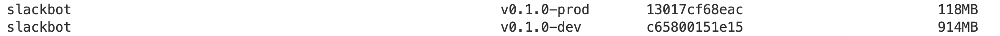

# SlackBot for listening Event/s  

**A Slackbot that listens for events in a Slack channel and responds when mentioned. This bot can be used to automate replies to specific triggers or commands within Slack channels.**

The project consists of several steps to set up a Slackbot that listens to events from a Slack channel and responds when mentioned. The process includes creating and configuring a GitHub repository, setting up a Slack App and channel, and exposing your bot with ngrok to handle incoming events.

Minimizing the size of the Docker image with 